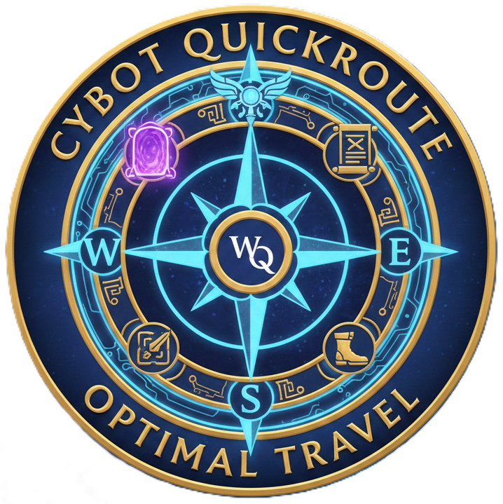
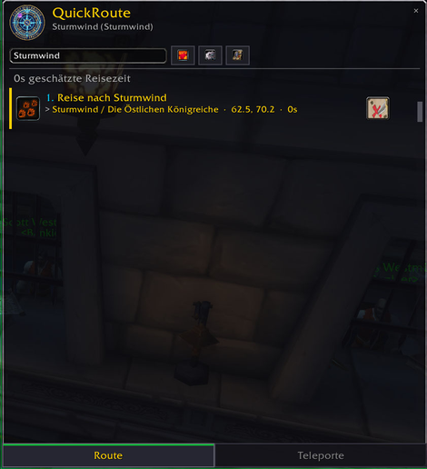
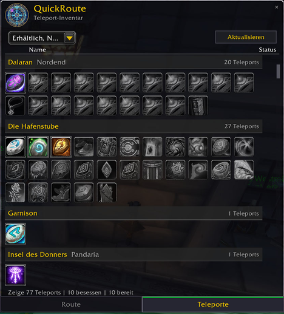
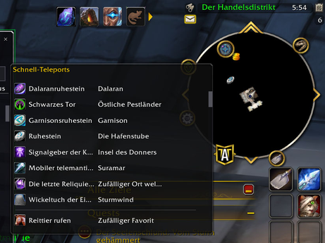

<p align="center">
  
</p>

<h1 align="center">QuickRoute</h1>


[](https://github.com/CybotTM/wow-quickroute/actions/workflows/ci.yml)


A World of Warcraft addon that calculates and displays the shortest path to any waypoint destination, recommending which teleport items to use or where the nearest portals are.

## Features

- **Smart Pathfinding:** Uses Dijkstra's algorithm to find the fastest route
- **Route Step Collapsing:** Merges consecutive walk/fly steps into readable directions
- **Teleport Detection:** Scans your inventory, toys, and spells for available teleports
- **Cooldown Tracking:** Considers teleport cooldowns when calculating routes
- **Portal Knowledge:** Knows all portal hub locations and connections
- **Faction-Aware:** Respects Alliance/Horde restrictions for portals and items
- **Class-Aware:** Includes class-specific teleports (Mage, Druid, Monk, DK, Shaman, DH)
- **TomTom Integration:** Automatically detects TomTom waypoints
- **Auto-Destination:** Automatically routes to super-tracked quests/waypoints
- **World Map Teleport Button:** One-click teleport button on the world map
- **Quest Tracker Buttons:** Teleport buttons next to tracked quests
- **Destination Grouping:** Group teleports by destination in the teleport panel
- **POI Click Routing:** Ctrl+Right-click on the world map to route to any location
- **Configurable Settings:** Max cooldown filter, loading screen time, window scale

## Screenshots

| Route Panel | Teleport Panel |
|:-----------:|:--------------:|
|  |  |

| Destination Search | Minimap Button |
|:------------------:|:--------------:|
|  |  |

## Installation

### Via CurseForge/WoWUp (Recommended)
Install from CurseForge or WoWUp - dependencies are resolved automatically.

### Manual Installation
1. Download and extract to `World of Warcraft\_retail_\Interface\AddOns\QuickRoute`
2. Restart WoW or `/reload`

## Usage

### Slash Commands
- `/qr` or `/quickroute` - Toggle the route window
- `/qr show` - Show the route window
- `/qr hide` - Hide the route window
- `/qr settings` - Open settings panel
- `/qr minimap` - Toggle minimap button
- `/qr debug` - Toggle debug mode
- `/qrhelp` - Show all commands
- `/qrwp` - Calculate path to current waypoint
- `/qrpath <mapID> <x> <y>` - Calculate path to coordinates
- `/qrteleports` - Toggle teleport panel
- `/qrinv` - Show available teleports
- `/qrcd` - Show teleport cooldowns
- `/qrscreenshot` - Take UI screenshots (`all`, `route`, `teleport`, `search`, `mini`)

### How to Use
1. Set a waypoint on your map (right-click) or use TomTom
2. Type `/qr` to open the route window
3. Follow the step-by-step instructions in the route window

## Dependencies

**Optional:**
- [TomTom](https://www.curseforge.com/wow/addons/tomtom) (for waypoint integration)

## Supported Teleports

### Items & Toys
- Hearthstones (regular, Dalaran, Garrison)
- Kirin Tor Rings (all variants)
- Tabards (Argent Crusader's, Tol Barad)
- Engineering devices (Wormhole Generators, Dimensional Rippers)
- Various toys (Direbrew's Remote, Tome of Town Portal, etc.)

### Class Spells
- **Mage:** All teleport spells (Vanilla through The War Within)
- **Druid:** Teleport: Moonglade, Dreamwalk
- **Monk:** Zen Pilgrimage
- **Death Knight:** Death Gate
- **Shaman:** Astral Recall
- **Demon Hunter:** Fel Retreat

### Portals
- Major hubs: Stormwind, Orgrimmar, Dalaran, Oribos, Valdrakken, Dornogal
- Boats, zeppelins, trams
- Druid Dreamway network

## Development

### Linting
```bash
# Install luacheck (requires LuaRocks)
luarocks install luacheck

# Run linter
./scripts/lint.sh
# or
luacheck QuickRoute/ --config .luacheckrc
```

### Important: WoW uses Lua 5.1
- No `goto` statements (added in Lua 5.2)
- No bitwise operators like `&`, `|` (use `bit.band`, `bit.bor`)
- No `//` floor division (use `math.floor`)

### CI
GitHub Actions automatically runs luacheck and syntax validation on PRs.

## License

MIT License - See LICENSE file for details.

## Author

Sebastian Mendel
