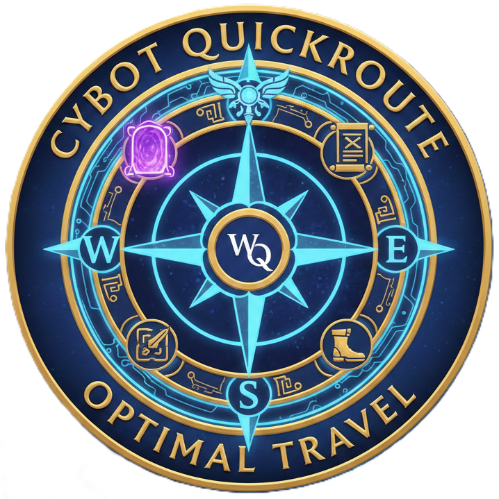
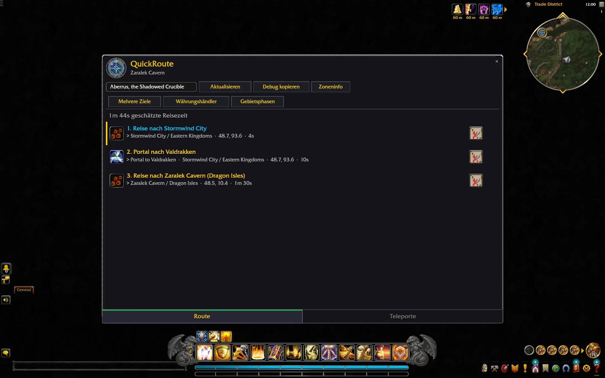
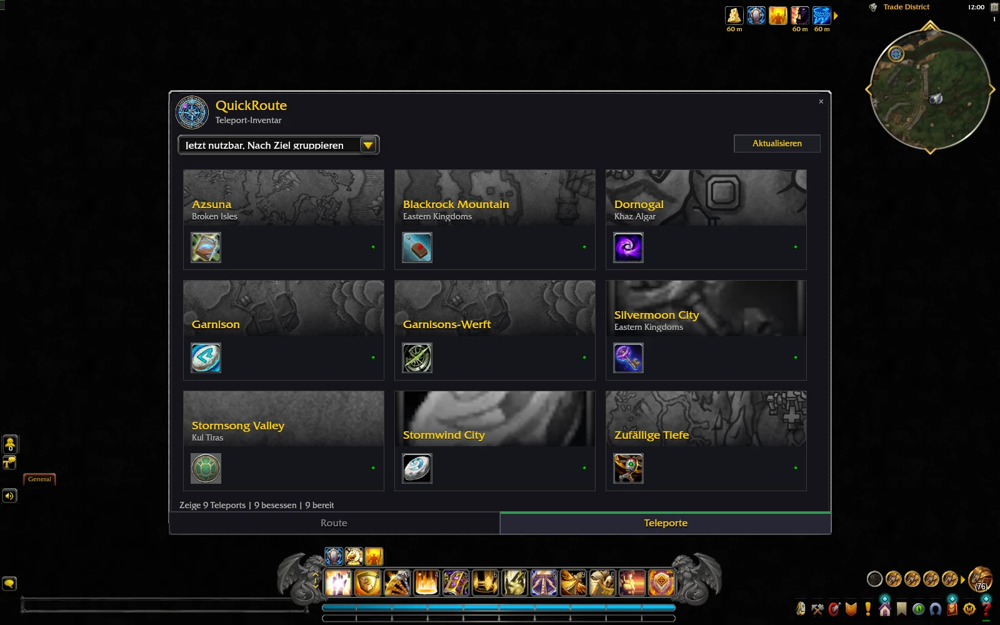
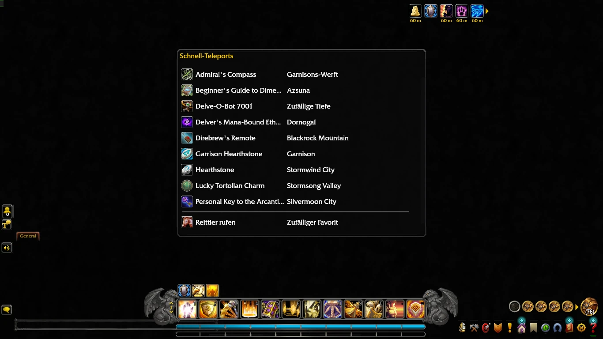
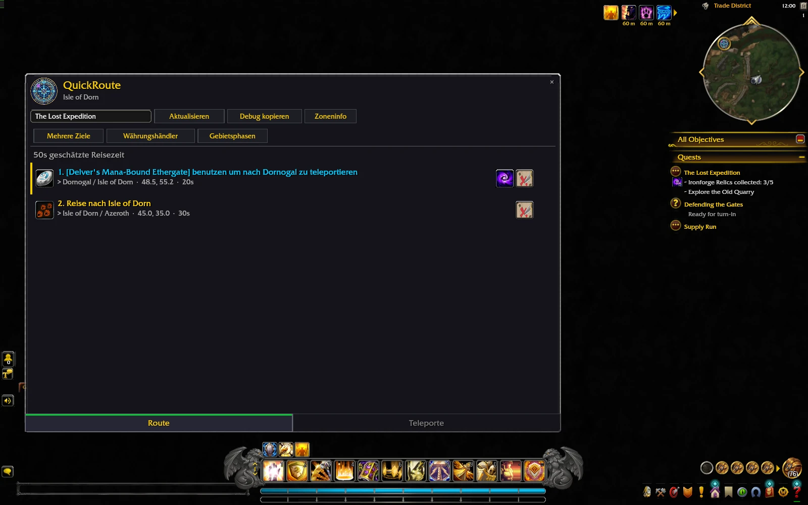
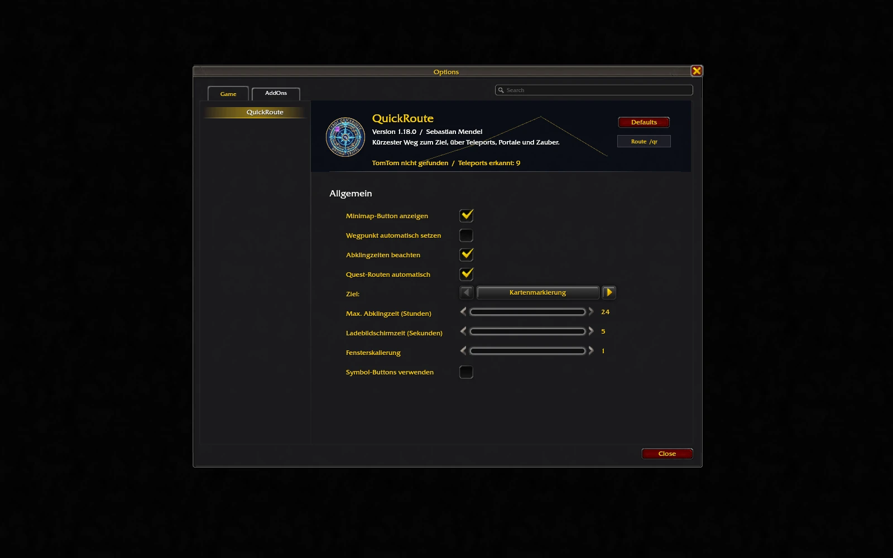
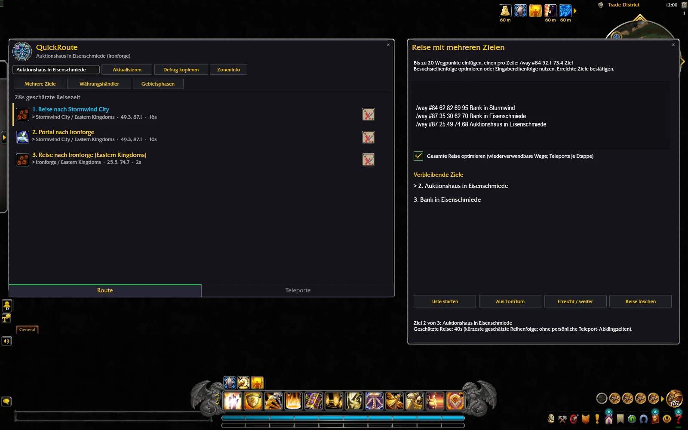
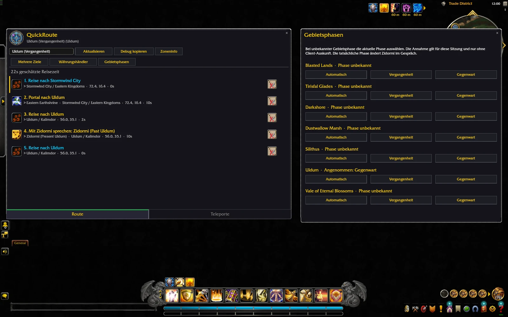

<p align="center">
  
</p>

<h1 align="center">QuickRoute</h1>


[](https://github.com/CybotTM/wow-quickroute/actions/workflows/ci.yml)


A World of Warcraft addon that estimates fast travel routes to map points, quest destinations and dungeon entrances using known teleports, portals and transport connections.

Routes depend on recorded connections, character access and estimated travel times. QuickRoute includes an attributed retail destination catalogue and phase/unlock checks. Terrain, dynamic NPCs and unreported game state can still limit a route. See the [review and coverage report](docs/REVIEW-2026-09-05.md) for verified behavior and coverage limits.

## What it does for you

- Get to a map pin, a quest objective, a dungeon entrance or a vendor, in steps this character can take.
- Paste a section of a community guide and run it as a trip.
- Find a destination by name when you do not know where it is.
- Refuse a step you cannot use and keep the destination.
- Be told which kind of problem stopped a route, rather than one message for every case.

The distribution listing text lives in [docs/CURSEFORGE-LISTING.md](docs/CURSEFORGE-LISTING.md).

## Features

- **Smart Pathfinding:** Uses Dijkstra's algorithm to find the lowest estimated travel time in the known graph
- **Route Step Collapsing:** Merges consecutive walk/fly steps into readable directions
- **Teleport Detection:** Scans your inventory, toys, and spells for available teleports
- **Cooldown Tracking:** Considers teleport cooldowns when calculating routes
- **Portal Knowledge:** Includes major portal hubs and recorded transport connections
- **Faction-Aware:** Respects Alliance/Horde restrictions for portals and items
- **Class-Aware:** Includes class-specific teleports (Mage, Druid, Monk, DK, Shaman, DH)
- **Dungeon Teleports:** Mythic+ and attunement teleports route to the dungeon entrance
- **Flight Paths:** Flight masters you have discovered are part of the route graph
- **TomTom Integration:** Automatically detects TomTom waypoints
- **Auto-Destination:** Automatically routes to super-tracked quests/waypoints
- **World Map Teleport Button:** One-click teleport button on the world map
- **Quest Tracker Buttons:** Teleport buttons next to tracked quests
- **Destination Grouping:** Group teleports by destination in the teleport panel
- **POI Click Routing:** Ctrl+Right-click on the world map to route to any location
- **Configurable Settings:** Max cooldown filter, loading screen time, window scale
- **Multi-Destination Trips:** Paste up to 20 waypoints or import active TomTom points; optimize the entire estimated visit order or follow input order; resume saved trips after login
- **Currency Vendors:** Search the included retail vendor catalogue and your character’s merchant observations for a selected currency
- **Quest Discovery:** Search thousands of attributed quest-giver and NPC locations; use live client coordinates for objectives and turn-ins
- **Zone Phases:** Route through seven Zidormi regions with explicit phase changes and visible controls for unknown states
- **Travel Choices:** Discovered Mole Machine stops, selectable engineering destinations, faction garrisons, and observed camp/house locations
- **Access Checks:** Known quest, level, class, faction, reputation and other requirements gate sourced travel connections
- **Automatic Hearth Destination:** Recognize known inns from the client's localized bind name, even before the first use. Morgenluft defaults to its current Midnight version. Observed bindings always take precedence over catalogue approximations and defaults.
- **Acquisition Help:** Click a missing teleport item for its ATT details, or open QuickRoute's source help with requirements and a route when a source position is known
- **Refuse a Step:** A step you cannot use gets a "Cannot use" button. QuickRoute keeps the destination, drops that connection for this route and looks for another way; right-clicking Refresh takes your refusals back
- **Says Why It Failed:** A route that cannot be produced names its reason — position not available yet, something this character does not have, a refused step, or no known connection — because those need different responses from you
- **Bounded Search:** A calculation another addon asks for through `QuickRouteAPI`, and the one behind a dungeon group offer, continue across frames instead of holding the client. A trip comparison and the quest-tracker buttons start one calculation per frame, which bounds how many run at once rather than what one of them costs. The route panel and map-click routing still calculate in one piece
- **Dungeon Group Offer:** Accepting a group invitation offers the way to that dungeon's entrance, and suspends the trip you were on rather than replacing it
- **For Other Addons:** `QuickRouteAPI` is a versioned contract another addon can ask for a route through, without taking over your arrow (see below)

## Screenshots

Current addon controls rendered with an explicit simulated character:

| Route Panel | Teleport Panel | Quick Teleports |
|:-----------:|:--------------:|:---------------:|
|  |  |  |



Settings branding fills the native header region above the divider:



The [screenshot fidelity review](docs/SCREENSHOT-REVIEW-2026-09-07.md) documents the renderer corrections, native Settings color measurement, scene fixtures and verification limits.

The trip example has completed its first stop and shows the computed next leg. The Uldum example targets the past version of the zone while the character is assumed to be in the present, so its route includes speaking to Zidormi.

| Trip planner | Zone phases |
|:------------:|:-----------:|
|  |  |

[Compare the same Uldum destination when already in the past phase](screenshots/zone-phases-past-review.webp).

## Installation

Every release goes to all three at once, from the same build.

| Source | |
|---|---|
| CurseForge | [QuickRoute](https://www.curseforge.com/wow/addons/quickroute) — or search "QuickRoute" in the CurseForge app or WoWUp |
| Wago | [QuickRoute](https://addons.wago.io/addons/quickroute) — or in the WagoApp |
| GitHub | [Latest release](https://github.com/CybotTM/wow-quickroute/releases/latest) |

An addon manager keeps QuickRoute current on its own, which matters here: the addon declares the game version it was built for, and WoW skips an addon whose declared version is behind the live patch unless "Load out of date AddOns" is ticked.

### Manual installation
1. Download `QuickRoute-<version>.zip` from the [latest release](https://github.com/CybotTM/wow-quickroute/releases/latest)
2. Extract into `World of Warcraft\_retail_\Interface\AddOns\` so the folder is named `QuickRoute`
3. Restart WoW or `/reload`

## Usage

### Slash Commands
- `/qr` or `/quickroute` - Toggle the route window
- `/qr show` - Show the route window
- `/qr hide` - Hide the route window
- `/qr settings` - Open settings panel
- `/qr minimap` - Toggle minimap button
- `/qr debug` - Toggle debug mode
- `/qr priority mappin|quest|tomtom` - Set the waypoint source priority
- `/qr autowaypoint` - Toggle the automatic waypoint for the first step
- `/qr ah` / `/qr bank` / `/qr void` / `/qr craft` - Route to the nearest auction house, bank, void storage or crafting table
- `/qr currency <ID or exact localized name>` - Route to the fastest known vendor accepting that currency
- `/qr quest <questID> [target|giver]` - Route to the live quest target/turn-in or a known quest giver
- `/qr phases` - Inspect detected phases and set session assumptions when the client cannot report a phase
- `/qr multi` or `/qrmulti` - Open the trip planner; paste `/way #mapID x y` lines with coordinates from 0 to 100
- `/qrmulti tomtom` / `/qrmulti next` / `/qrmulti clear` - Import active TomTom destinations, mark a stop reached, or clear the trip
- `/qrhelp` - Show all commands
- `/qrwp` - Calculate path to current waypoint
- `/qrverifymap [mapID]` - Report what the client and the addon each say about a map
- `/qrpath <mapID> <x> <y>` - Calculate path to coordinates
- `/qrteleports` - Toggle teleport panel
- `/qrdungeons` - Toggle the dungeon and raid picker
- `/qrinv` - Show available teleports
- `/qrcd` - Show teleport cooldowns
- `/qrdebug` - Show waypoint detection info (`/qrdebug copy` yields markdown for bug reports)
- `/qrscreenshot` - Take UI screenshots (`all`, `route`, `teleport`, `search`, `mini`)
- `/qrextract` - Extract data for development (`zones`, `quests`, `portals`, `continent`)

Development commands, not part of the supported surface: `/qrscan`, `/qrgraph`,
`/qrzone`, `/qrdebugpath`, `/qrtest graph`.

### How to Use
1. Set a waypoint on your map (right-click) or use TomTom
2. Type `/qr` to open the route window
3. Follow the step-by-step instructions in the route window

The route toolbar opens **Currency vendors**, **Multi-route** and **Zone phases**. Currency results combine the included catalogue with your observed merchants and filter known access requirements. Search accepts NPC/quest names or IDs. Reference quest coordinates are labeled separately from live quest objectives and turn-ins.

In the Teleports tab, **left-click a missing item** to open its source details in ALL THE THINGS (ATT). If ATT is unavailable, QuickRoute opens its own help. **Right-click**, or use **How to obtain** in list view, to open QuickRoute's help directly. It combines available requirements with a short ATT source preview, a copyable Wowhead link and a route button for known source positions. Unknown positions remain explicit. Account-wide toy ownership does not make that toy usable by every race, class or profession.

Trips support up to 20 stops and persist per character. Up to ten stops use an exact shortest-order solver for the estimated reusable-route matrix; larger lists use a bounded optimization heuristic. The matrix keeps a teleport whose catalogue record states a cooldown of zero, because that one is available for every leg; a teleport with a cooldown, or with none recorded, stays out of it. The matrix uses the phase/access state available during comparison. Each executable leg is recalculated from your actual position and available teleports. Confirm a reached stop to continue. Random landings are not presented as exact teleport destinations.

A missing route means the addon lacks a usable recorded connection or required state; it does not prove the destination is inaccessible in the game. Known hearth inns are resolved automatically from their localized name. Morgenluft uses the current Midnight inn as its default; an observed arrival or binding overrides it, including a binding in the legacy area. Other unknown or ambiguous inns require an observed arrival or binding. Catalogue coordinates approximate the inn, not the precise landing; [coverage and sources](docs/data/hearthstone-locations.md) describe the limits. Housing destinations require owned-house identity and an observed neighborhood plot position. Phase assumptions never change your character’s actual phase or mark an unperformed Zidormi conversation complete.

## For addon authors

`QuickRouteAPI` is a global table another addon can use to ask QuickRoute for a
route. It is versioned: `QuickRouteAPI:GetVersion()` returns the contract version
this build implements.

```lua
local handle = QuickRouteAPI:CalculateRoute(
    { mapID = 84, x = 0.5, y = 0.6, title = "Stormwind", role = "objective" },
    function(route, failure)
        if not route then
            print("no route:", failure.reason, failure.retryable)
            return
        end
        print(route.totalTime, #route.steps)
    end
)
-- Later, if the answer is no longer wanted:
QuickRouteAPI:Cancel(handle)
```

What the contract guarantees:

- The callback receives either a route or a named failure, never silence. A
  request superseded by a newer one is told so.
- The result is a detached copy. Only the fields the contract names cross the
  boundary, so an internal rename cannot break a consumer.
- `route.assumptions` states what the estimate rests on: which maps have unknown
  movement eligibility, whether a flight time is a distance heuristic, and which
  legs land on a guessed position rather than an observed one.
- Nothing in the contract sets a waypoint, moves your arrow or starts travel.

`QuickRouteAPI:RejectStep(from, to, destination)` and `AcceptStep(from, to)` are
the same refusal the "Cannot use" button makes, for a consumer that renders its
own step list. A refusal applies to the destination it was made for and is never
written to disk.

## Dependencies

**Optional:**
- [TomTom](https://www.curseforge.com/wow/addons/tomtom) (for waypoint integration)
- [ALL THE THINGS](https://github.com/ATTWoWAddon/AllTheThings) (for missing-item source details; QuickRoute also works without it)

## Supported Teleports

### Items & Toys
- Hearthstones (regular, Dalaran, Garrison)
- Kirin Tor Rings (all variants)
- Tabards (Argent Crusader's, Tol Barad)
- Engineering devices (Wormhole Generators, Dimensional Rippers)
- Various toys (Direbrew's Remote, Tome of Town Portal, etc.)

### Class Spells
- **Mage:** Recorded city teleports, including Shattrath, Dalaran, Valdrakken and Dornogal
- **Druid:** Teleport: Moonglade, Dreamwalk
- **Monk:** Zen Pilgrimage
- **Death Knight:** Death Gate
- **Shaman:** Astral Recall
- **Demon Hunter:** Fel Retreat

### Portals
- Major hubs: Stormwind, Orgrimmar, Dalaran, Oribos, Valdrakken, Dornogal
- Boats, zeppelins, trams
- Druid Dreamway network

## Development

### Linting
```bash
# Install luacheck (requires LuaRocks)
luarocks install luacheck

# Run linter
./scripts/lint.sh
# or
luacheck QuickRoute/ --config .luacheckrc
```

### Important: WoW uses Lua 5.1
- No `goto` statements (added in Lua 5.2)
- No bitwise operators like `&`, `|` (use `bit.band`, `bit.bor`)
- No `//` floor division (use `math.floor`)

### CI
GitHub Actions automatically runs luacheck and syntax validation on PRs.

## License

MIT License - See LICENSE file for details.

Adapted destination and transport data retain their upstream notices: [Mapzeroth](QuickRoute/ThirdParty/Mapzeroth-NOTICE.md) and [AllTheThings](QuickRoute/Licenses/AllTheThings-MIT.txt). The [catalogue source manifest](QuickRoute/Data/DestinationCatalog.sources.txt) pins the input revision and file hashes. Regenerate with `python3 scripts/generate_destination_catalog.py --help`; upstream Lua is parsed as data and never executed.

## Author

Sebastian Mendel
